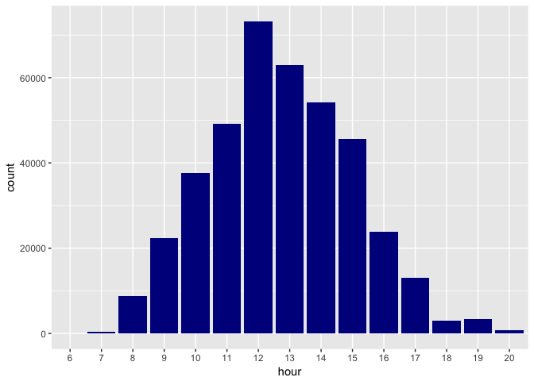
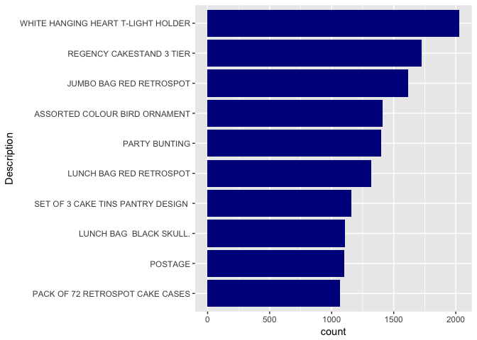
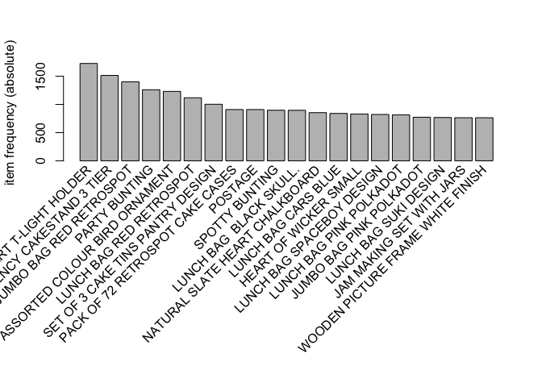
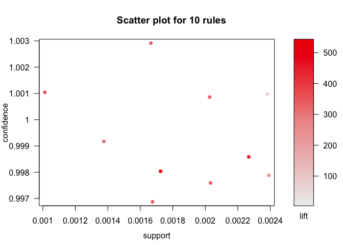
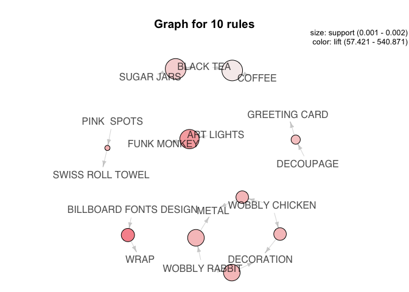

Association Rule Mining - Market Basket Analysis
================

GitHub Documents
----------------

This is an R Markdown format used for publishing markdown documents to GitHub. When you click the **Knit** button all R code chunks are run and a markdown file (.md) suitable for publishing to GitHub is generated.

Including Code
--------------

You can include R code in the document as follows:

``` r
library(tidyverse)
```

    ## Loading tidyverse: ggplot2
    ## Loading tidyverse: tibble
    ## Loading tidyverse: tidyr
    ## Loading tidyverse: readr
    ## Loading tidyverse: purrr
    ## Loading tidyverse: dplyr

    ## Conflicts with tidy packages ----------------------------------------------

    ## filter(): dplyr, stats
    ## lag():    dplyr, stats

``` r
library(readxl)
library(knitr)
library(ggplot2)
library(lubridate)
```

    ## 
    ## Attaching package: 'lubridate'

    ## The following object is masked from 'package:base':
    ## 
    ##     date

``` r
library(arules)
```

    ## Loading required package: Matrix

    ## 
    ## Attaching package: 'Matrix'

    ## The following object is masked from 'package:tidyr':
    ## 
    ##     expand

    ## 
    ## Attaching package: 'arules'

    ## The following object is masked from 'package:dplyr':
    ## 
    ##     recode

    ## The following objects are masked from 'package:base':
    ## 
    ##     abbreviate, write

``` r
library(arulesViz)
```

    ## Loading required package: grid

``` r
library(plyr)
```

    ## -------------------------------------------------------------------------

    ## You have loaded plyr after dplyr - this is likely to cause problems.
    ## If you need functions from both plyr and dplyr, please load plyr first, then dplyr:
    ## library(plyr); library(dplyr)

    ## -------------------------------------------------------------------------

    ## 
    ## Attaching package: 'plyr'

    ## The following object is masked from 'package:lubridate':
    ## 
    ##     here

    ## The following objects are masked from 'package:dplyr':
    ## 
    ##     arrange, count, desc, failwith, id, mutate, rename, summarise,
    ##     summarize

    ## The following object is masked from 'package:purrr':
    ## 
    ##     compact

``` r
setwd("/Users/Deepika/Desktop/Learning/R Bloggers Exercise")

retail <- read_excel('Online Retail.xlsx')
retail <- retail[complete.cases(retail), ]
```

Structure of DataSet
====================

``` r
str(retail)
```

    ## Classes 'tbl_df', 'tbl' and 'data.frame':    397924 obs. of  8 variables:
    ##  $ InvoiceNo  : num  536365 536365 536365 536365 536365 ...
    ##  $ StockCode  : chr  "85123A" "71053" "84406B" "84029G" ...
    ##  $ Description: chr  "WHITE HANGING HEART T-LIGHT HOLDER" "WHITE METAL LANTERN" "CREAM CUPID HEARTS COAT HANGER" "KNITTED UNION FLAG HOT WATER BOTTLE" ...
    ##  $ Quantity   : num  6 6 8 6 6 2 6 6 6 32 ...
    ##  $ InvoiceDate: POSIXct, format: "2010-12-01 08:26:00" "2010-12-01 08:26:00" ...
    ##  $ UnitPrice  : num  2.55 3.39 2.75 3.39 3.39 7.65 4.25 1.85 1.85 1.69 ...
    ##  $ CustomerID : num  17850 17850 17850 17850 17850 ...
    ##  $ Country    : chr  "United Kingdom" "United Kingdom" "United Kingdom" "United Kingdom" ...

Dimensions of DataSet
=====================

``` r
dim(retail)
```

    ## [1] 397924      8

name sof Columns of DataSet
===========================

``` r
names(retail)
```

    ## [1] "InvoiceNo"   "StockCode"   "Description" "Quantity"    "InvoiceDate"
    ## [6] "UnitPrice"   "CustomerID"  "Country"

Any 'NA's' in DataSet
=====================

``` r
any(is.na(retail))
```

    ## [1] FALSE

First few records of DataSet
============================

``` r
head(retail)
```

    ## # A tibble: 6 x 8
    ##   InvoiceNo StockCode                         Description Quantity
    ##       <dbl>     <chr>                               <chr>    <dbl>
    ## 1    536365    85123A  WHITE HANGING HEART T-LIGHT HOLDER        6
    ## 2    536365     71053                 WHITE METAL LANTERN        6
    ## 3    536365    84406B      CREAM CUPID HEARTS COAT HANGER        8
    ## 4    536365    84029G KNITTED UNION FLAG HOT WATER BOTTLE        6
    ## 5    536365    84029E      RED WOOLLY HOTTIE WHITE HEART.        6
    ## 6    536365     22752        SET 7 BABUSHKA NESTING BOXES        2
    ## # ... with 4 more variables: InvoiceDate <dttm>, UnitPrice <dbl>,
    ## #   CustomerID <dbl>, Country <chr>

Data Cleaning
=============

Change Datatype of below columns 1. Description to Factor 2. Country to Factor 3. Data to Date 4. Time to Time 5. InvoiceNo to Numeric

``` r
retail$Description <- as.factor(retail$Description)
retail$Country <- as.factor(retail$Country)
retail$Date <- as.Date(retail$InvoiceDate)
retail$Time <- format(retail$InvoiceDate,"%H:%M:%S")
retail$Time <- hms(retail$Time)
retail$InvoiceNo <- as.numeric(as.character(retail$InvoiceNo))
str(retail)
```

    ## Classes 'tbl_df', 'tbl' and 'data.frame':    397924 obs. of  10 variables:
    ##  $ InvoiceNo  : num  536365 536365 536365 536365 536365 ...
    ##  $ StockCode  : chr  "85123A" "71053" "84406B" "84029G" ...
    ##  $ Description: Factor w/ 3877 levels " 4 PURPLE FLOCK DINNER CANDLES",..: 3699 3707 859 1805 2764 2965 1436 1554 1551 217 ...
    ##  $ Quantity   : num  6 6 8 6 6 2 6 6 6 32 ...
    ##  $ InvoiceDate: POSIXct, format: "2010-12-01 08:26:00" "2010-12-01 08:26:00" ...
    ##  $ UnitPrice  : num  2.55 3.39 2.75 3.39 3.39 7.65 4.25 1.85 1.85 1.69 ...
    ##  $ CustomerID : num  17850 17850 17850 17850 17850 ...
    ##  $ Country    : Factor w/ 37 levels "Australia","Austria",..: 35 35 35 35 35 35 35 35 35 35 ...
    ##  $ Date       : Date, format: "2010-12-01" "2010-12-01" ...
    ##  $ Time       :Formal class 'Period' [package "lubridate"] with 6 slots
    ##   .. ..@ .Data : num  0 0 0 0 0 0 0 0 0 0 ...
    ##   .. ..@ year  : num  0 0 0 0 0 0 0 0 0 0 ...
    ##   .. ..@ month : num  0 0 0 0 0 0 0 0 0 0 ...
    ##   .. ..@ day   : num  0 0 0 0 0 0 0 0 0 0 ...
    ##   .. ..@ hour  : num  8 8 8 8 8 8 8 8 8 8 ...
    ##   .. ..@ minute: num  26 26 26 26 26 26 26 28 28 34 ...

``` r
glimpse(retail)
```

    ## Observations: 397,924
    ## Variables: 10
    ## $ InvoiceNo   <dbl> 536365, 536365, 536365, 536365, 536365, 536365, 53...
    ## $ StockCode   <chr> "85123A", "71053", "84406B", "84029G", "84029E", "...
    ## $ Description <fctr> WHITE HANGING HEART T-LIGHT HOLDER, WHITE METAL L...
    ## $ Quantity    <dbl> 6, 6, 8, 6, 6, 2, 6, 6, 6, 32, 6, 6, 8, 6, 6, 3, 2...
    ## $ InvoiceDate <dttm> 2010-12-01 08:26:00, 2010-12-01 08:26:00, 2010-12...
    ## $ UnitPrice   <dbl> 2.55, 3.39, 2.75, 3.39, 3.39, 7.65, 4.25, 1.85, 1....
    ## $ CustomerID  <dbl> 17850, 17850, 17850, 17850, 17850, 17850, 17850, 1...
    ## $ Country     <fctr> United Kingdom, United Kingdom, United Kingdom, U...
    ## $ Date        <date> 2010-12-01, 2010-12-01, 2010-12-01, 2010-12-01, 2...
    ## $ Time        <S4: Period> 8H 26M 0S, 8H 26M 0S, 8H 26M 0S, 8H 26M 0S,...

To find out at what hour customers did maximum purchase
=======================================================

``` r
retail %>% mutate(hour = as.factor(hour(Time))) %>% ggplot(aes(x = hour)) + geom_histogram(stat = 'count',fill = "dark blue")
```

 \#Top 10 best sellers

``` r
retail %>% select(Description,StockCode,Quantity) %>% group_by(Description,StockCode) %>% dplyr::summarize(count= n()) %>%
             arrange(desc(count)) %>% head(10) %>% mutate(Description = reorder(Description,count)) %>%
             ggplot(aes(Description,count)) + geom_bar(stat='identity',fill = 'Dark Blue') +coord_flip()
```

 \# Before applying rule mining, we need to break down data frame to check what item was purchased in conjunction with what

``` r
retail_sorted <- retail[order(retail$CustomerID),]

library(plyr)
itemList <- ddply(retail,c("CustomerID","Date"), function(df1)paste(df1$Description,collapse = ","))

itemList$CustomerID <- NULL
itemList$Date <- NULL
colnames(itemList) <- c("items")

write.csv(itemList,"market_basket.csv", quote = FALSE, row.names = TRUE)

tr <- read.transactions('market_basket.csv', format = 'basket', sep=',')
tr
```

    ## transactions in sparse format with
    ##  16767 transactions (rows) and
    ##  24565 items (columns)

``` r
summary(tr)
```

    ## transactions as itemMatrix in sparse format with
    ##  16767 rows (elements/itemsets/transactions) and
    ##  24565 columns (items) and a density of 0.0008295884 
    ## 
    ## most frequent items:
    ## WHITE HANGING HEART T-LIGHT HOLDER           REGENCY CAKESTAND 3 TIER 
    ##                               1726                               1514 
    ##            JUMBO BAG RED RETROSPOT                      PARTY BUNTING 
    ##                               1401                               1260 
    ##      ASSORTED COLOUR BIRD ORNAMENT                            (Other) 
    ##                               1231                             334560 
    ## 
    ## element (itemset/transaction) length distribution:
    ## sizes
    ##   1   2   3   4   5   6   7   8   9  10  11  12  13  14  15  16  17  18 
    ##   1 962 605 581 631 662 625 595 581 571 542 571 497 473 513 503 489 454 
    ##  19  20  21  22  23  24  25  26  27  28  29  30  31  32  33  34  35  36 
    ## 419 475 411 379 299 311 273 241 243 224 203 221 211 161 152 142 139 135 
    ##  37  38  39  40  41  42  43  44  45  46  47  48  49  50  51  52  53  54 
    ## 112 113  88 107  91  88  87  93  68  61  69  68  61  54  47  62  47  41 
    ##  55  56  57  58  59  60  61  62  63  64  65  66  67  68  69  70  71  72 
    ##  55  48  34  27  40  32  29  27  24  24  22  19  26  28  20  16  23  20 
    ##  73  74  75  76  77  78  79  80  81  82  83  84  85  86  87  88  89  90 
    ##  16  21  15  12  18  12   7  11  16  16  14   8   7  14  11  14   8   7 
    ##  91  92  93  94  95  96  97  98  99 100 101 102 103 104 105 106 107 108 
    ##   5   6   8   7   4   4   5   5   6   3   5   2   4   4   1   3   4   8 
    ## 109 110 111 112 113 114 115 116 117 118 119 120 121 122 123 124 126 127 
    ##   5   5   3   2   1   3   2   1   3   3   3   1   2   2   2   1   4   1 
    ## 128 132 133 134 135 140 141 142 143 144 146 147 148 150 151 155 158 162 
    ##   2   1   1   2   1   1   1   1   2   1   1   3   1   1   1   2   2   1 
    ## 167 169 172 178 179 181 199 200 203 205 206 210 229 237 250 251 286 321 
    ##   1   1   2   1   1   1   1   1   1   1   1   1   1   1   1   1   1   1 
    ## 401 420 
    ##   1   1 
    ## 
    ##    Min. 1st Qu.  Median    Mean 3rd Qu.    Max. 
    ##    1.00    8.00   15.00   20.38   26.00  420.00 
    ## 
    ## includes extended item information - examples:
    ##     labels
    ## 1        1
    ## 2 1 HANGER
    ## 3       10

Frequency Plot of Items
=======================

``` r
itemFrequencyPlot(tr, topN=20, type='absolute')
```

 \# Rule Mining using Apriori

``` r
rules <- apriori(tr, parameter = list(supp=0.001, conf=0.8))
```

    ## Apriori
    ## 
    ## Parameter specification:
    ##  confidence minval smax arem  aval originalSupport maxtime support minlen
    ##         0.8    0.1    1 none FALSE            TRUE       5   0.001      1
    ##  maxlen target   ext
    ##      10  rules FALSE
    ## 
    ## Algorithmic control:
    ##  filter tree heap memopt load sort verbose
    ##     0.1 TRUE TRUE  FALSE TRUE    2    TRUE
    ## 
    ## Absolute minimum support count: 16 
    ## 
    ## set item appearances ...[0 item(s)] done [0.00s].
    ## set transactions ...[24565 item(s), 16767 transaction(s)] done [0.07s].
    ## sorting and recoding items ... [2511 item(s)] done [0.01s].
    ## creating transaction tree ... done [0.01s].
    ## checking subsets of size 1 2 3 4 5 6 7 8 9 10 done [0.90s].
    ## writing ... [180328 rule(s)] done [0.11s].
    ## creating S4 object  ... done [0.12s].

``` r
rules <- sort(rules, by='confidence', decreasing = TRUE)
```

Number of Rules and take Top 10 Rules

``` r
summary(rules)
```

    ## set of 180328 rules
    ## 
    ## rule length distribution (lhs + rhs):sizes
    ##     2     3     4     5     6     7     8     9    10 
    ##   121  4704 14560 40066 60294 43314 14763  2267   239 
    ## 
    ##    Min. 1st Qu.  Median    Mean 3rd Qu.    Max. 
    ##   2.000   5.000   6.000   5.982   7.000  10.000 
    ## 
    ## summary of quality measures:
    ##     support           confidence          lift        
    ##  Min.   :0.001014   Min.   :0.8000   Min.   :  7.771  
    ##  1st Qu.:0.001074   1st Qu.:0.8378   1st Qu.: 17.260  
    ##  Median :0.001133   Median :0.8800   Median : 21.672  
    ##  Mean   :0.001314   Mean   :0.8877   Mean   : 38.614  
    ##  3rd Qu.:0.001372   3rd Qu.:0.9444   3rd Qu.: 32.598  
    ##  Max.   :0.024453   Max.   :1.0000   Max.   :789.582  
    ## 
    ## mining info:
    ##  data ntransactions support confidence
    ##    tr         16767   0.001        0.8

``` r
inspect(rules[1:10])
```

    ##      lhs                         rhs                support     confidence
    ## [1]  {PINK  SPOTS}            => {SWISS ROLL TOWEL} 0.001013896 1         
    ## [2]  {WOBBLY CHICKEN}         => {DECORATION}       0.001669947 1         
    ## [3]  {WOBBLY CHICKEN}         => {METAL}            0.001669947 1         
    ## [4]  {DECOUPAGE}              => {GREETING CARD}    0.001371742 1         
    ## [5]  {BILLBOARD FONTS DESIGN} => {WRAP}             0.001729588 1         
    ## [6]  {WOBBLY RABBIT}          => {DECORATION}       0.002027793 1         
    ## [7]  {WOBBLY RABBIT}          => {METAL}            0.002027793 1         
    ## [8]  {BLACK TEA}              => {SUGAR JARS}       0.002385638 1         
    ## [9]  {BLACK TEA}              => {COFFEE}           0.002385638 1         
    ## [10] {ART LIGHTS}             => {FUNK MONKEY}      0.002266357 1         
    ##      lift     
    ## [1]  356.74468
    ## [2]  335.34000
    ## [3]  335.34000
    ## [4]  304.85455
    ## [5]  540.87097
    ## [6]  335.34000
    ## [7]  335.34000
    ## [8]  220.61842
    ## [9]   57.42123
    ## [10] 441.23684

``` r
topRules <- rules[1:10]
plot(topRules)
```

 Plotting the rules in a graph

``` r
plot(topRules, method="graph")
```


